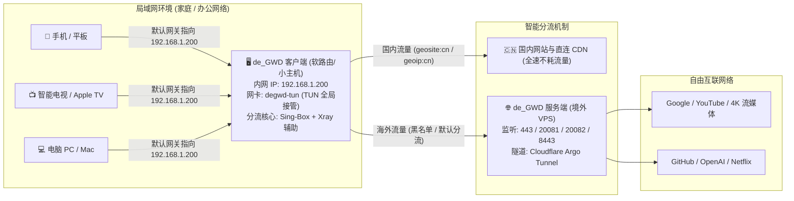

# de_GWD NextGen (v2.0)

> 现代高性能透明网络网关与防审查协议路由套件  
> 专为新版 **Debian 11 / 12 / 13** 与 **Ubuntu 20.04 / 22.04 / 24.04 LTS** 深度优化

[](LICENSE.md)
[](#系统兼容性)
[](#系统兼容性)
[](#一新一代协议矩阵)

---

## 📖 目录
- [一、双端架构与工作原理（服务端 vs 客户端）](#一双端架构与工作原理服务端-vs-客户端)
- [二、新一代全协议矩阵](#二新一代全协议矩阵)
- [三、极速一键部署指南](#三极速一键部署指南)
  - [1. 境外 VPS 部署服务端 (Server)](#1-境外-vps-部署服务端-server)
  - [2. 本地设备部署客户端 (Client / 透明网关)](#2-本地设备部署客户端-client--透明网关)
- [四、经典 Web 控制面板使用指南](#四经典-web-控制面板使用指南)
- [五、局域网全屋免翻配置（旁路由联动模式）](#五局域网全屋免翻配置旁路由联动模式)
- [六、常用运维与管理指令速查表](#六常用运维与管理指令速查表)
- [七、系统兼容性与安全原则](#七系统兼容性与安全原则)

---

## 一、双端架构与工作原理（服务端 vs 客户端）

`de_GWD NextGen` 采用 **境外服务端 (出口节点)** + **本地客户端 (透明网关与控制器)** 双端协同架构，彻底解决单机翻墙软件配置繁琐、全屋多设备难以统一出海的问题。



### 角色职责分工：
1. **服务端 (Server · 运行在境外 VPS 上)**：
   - 负责承载真实网络出口，监听防审查安全端口；
   - 部署最新的防封锁协议栈（VLESS-REALITY、VLESS-xhttp、VLESS-WS、Hysteria 2）；
   - 支持 Cloudflare Argo 穿透隧道，生成免证书、免备案穿透节点。
2. **客户端 (Client · 运行在本地小主机 / 软路由上)**：
   - 负责建立系统虚拟网卡（`degwd-tun`）接管网络；
   - 执行国内外流量智能分流（国内域名和 IP 直连，海外流量加密转发到服务端）；
   - 充当全屋局域网“旁路由/网关”，让手机、电视、主机无需安装任何客户端直接免翻出海；
   - 提供可视化 Web 控制面板（经典寒月 SB-Admin 界面），支持一键链接解析导入与节点切换。

---

## 二、新一代全协议矩阵

全面集成并升级多协议栈，完整兼容 **argosbx（甬哥全套协议）** 及各大主流节点订阅：

| 协议类型 | 传输层 (Network) | 安全层 (Security) | 特性优势 | 核心引擎 |
| :--- | :--- | :--- | :--- | :--- |
| **VLESS-REALITY** | TCP + xtls-rprx-vision | REALITY (伪装 SNI) | 免证书免域名、零拷贝 Splice 极速吞吐、彻底免疫主动探测 | Sing-Box / Xray 原生 |
| **VLESS-xhttp-enc** | xhttp (SplitHTTP) | REALITY / TLS | 支持 Post-Quantum 抗量子 ENC 加密 (`mlkem768x25519plus`)，兼具极速与强抗封 | Xray 核心引擎 |
| **VLESS-ws-enc** | WebSocket | 无 / TLS | 兼容性极佳，支持挂载 CDN 优选 IP 或反代加速 | Xray / Sing-Box |
| **VLESS-Argo-TLS** | WebSocket | TLS (443 端口) | 基于 Cloudflare Argo 官方隧道穿透，免公网 IP，免域名证书 | Cloudflared + Xray |
| **VLESS-Argo-HTTP** | WebSocket | 明文 (80 端口) | Argo 隧道 80 端口备用穿透链路，自选优选 IP | Cloudflared + Xray |
| **Hysteria 2** | UDP / QUIC | TLS (双向自签/域名) | 专治恶劣国际网络拥塞，高丢包（5%~30%）下依然跑满带宽，抗 UDP QoS | Sing-Box 原生 |
| **VMess / Trojan** | TCP / WS | TLS / none | 传统协议向下全量兼容 | Sing-Box |

---

## 三、极速一键部署指南

### 1. 境外 VPS 部署服务端 (Server)

在海外服务器（推荐 Debian 12 或 Ubuntu 22.04/24.04）上以 `root` 权限执行通用安装脚本：

```bash
apt-get update && apt-get install -y curl
bash <(curl -fsSL https://raw.githubusercontent.com/zhengwuji/de_GWD/main/install.sh)
```
> *若遇网络延迟，可使用加速通道：`bash <(curl -fsSL https://ghfast.top/https://raw.githubusercontent.com/zhengwuji/de_GWD/main/install.sh)`*

#### 交互安装流程：
1. 菜单输入 `1` 选择 **「部署服务端」**；
2. 设定监听端口（支持回车使用推荐默认值）：
   - `VLESS-REALITY` 端口：默认 `443`
   - `VLESS-xhttp` 端口：默认 `20081`
   - `VLESS-WS` 端口：默认 `20082`
   - `Hysteria 2` 端口：默认 `8443`
3. 选择伪装域名 SNI（推荐选项 1：`www.microsoft.com` 或 2：`gateway.icloud.com`）；
4. 选择是否开启 Cloudflare Argo 穿透隧道（默认 `Y` 自动创建穿透域名）；
5. 脚本自动安装核心、生成抗量子密钥、配置 Systemd 守护服务并输出节点卡片。

安装完成后，终端将展示上述 **6 类节点直连链接（`vless://...` 与 `hysteria2://...`）、ASCII 二维码、Clash.Meta 配置片段以及 Base64 订阅**。  
👉 **请复制其中生成的节点链接，用于下一步客户端导入。**

---

### 2. 本地设备部署客户端 (Client / 透明网关)

在本地软路由、小主机或 Linux 虚拟机中执行相同的安装脚本：

```bash
bash <(curl -fsSL https://raw.githubusercontent.com/zhengwuji/de_GWD/main/install.sh)
```

#### 部署方式一：命令行终端极速导入
1. 菜单输入 `2` 选择 **「部署客户端 / 透明网关」**；
2. 选择 `1. 粘贴服务端节点链接`；
3. 直接粘贴在服务端获取的任意链接（或 `argosbx` 生成的链接）；
4. 客户端内置的万能解析器自动提取协议、地址、端口、REALITY 公钥、Short ID、xhttp 路径与抗量子 ENC 加密串，并自动配置 TUN 网卡与防火墙 NAT；
5. 部署完成，透明网关守护进程立即生效。

#### 部署方式二：Web 控制面板图形化导入
若设备已完成基础安装，推荐通过内置的 Web 控制面板进行可视化管理（详见下节）。

---

## 四、经典 Web 控制面板使用指南

客户端内置保留了原汁原味的经典 **寒月 de_GWD SB-Admin** 控制面板，并针对新协议进行了全面扩展：

- **面板地址**：在浏览器访问 `http://<客户端机器内网IP>/`
- **默认登录**：默认无密码或通过终端输入 `degwd-client` 选项 `6` 随时自定义管理密码。

### 核心功能操作：
1. **「节点管理」页面**：
   - **一键导入链接**：点击右上角「导入链接」，可直接批量粘贴 `vless://`、`hysteria2://`、`vmess://` 格式链接，毫秒级解析入库。
   - **智能协议徽章**：表格自动标明节点属性：
     - <span style="color:#28a745;font-weight:bold;">VLESS-REALITY</span>：经典无证书极速直连
     - <span style="color:#dc3545;font-weight:bold;">VLESS-xhttp</span>：抗量子 ENC + SplitHTTP 抗封模式
     - <span style="color:#ffc107;font-weight:bold;">VLESS-Argo</span>：Cloudflare 隧道公网穿透模式
     - <span style="color:#17a2b8;font-weight:bold;">VLESS-WS</span>：WebSocket 模式
     - <span style="color:#007bff;font-weight:bold;">Hysteria 2</span>：UDP/QUIC 抗高丢包加速模式
   - **协议高级参数模态框**：点击「参数」按钮，可可视化调整伪装域名 (SNI)、Host 标头、路径 (Path)、抗量子加密密钥与流控开关。
   - **保存与热重载**：点击「保存全部」，底层自动调度 Sing-Box 与 Xray 出站引擎完成原子级热加载，网络不中断。
2. **「概览」仪表盘**：
   - 实时监控内核透明网关服务状态、系统 BBR 拥塞控制状态；
   - 提供全链路真实网络延迟测速卡片（极速体检国内百度、Cloudflare、Google、YouTube 往返 RTT）。

---

## 五、局域网全屋免翻配置（旁路由联动模式）

完成客户端部署后，局域网内的所有手机、电脑、智能电视、游戏机（Switch / PS5）无需下载安装任何代理软件，即可实现全屋设备自动出海：

### 1. 查看客户端内网 IP
在客户端终端运行 `ip -4 addr show` 或 `degwd-client` 选项 `8` 查看内网 IP（例如 `192.168.1.200`）。

### 2. 终端设备网络设置（以 iPhone / Android / Windows PC 为例）
1. 打开设备的 **Wi-Fi 或有线网络属性**；
2. 将 **IP 获取方式** 从 `DHCP (自动)` 调整为 **静态 (手动)**；
3. 保留设备现有的 IP 地址与子网掩码（如 `255.255.255.0`）；
4. **默认网关 (Gateway)**：修改为 `192.168.1.200`（指向 de_GWD 客户端）；
5. **DNS 服务器**：修改为 `192.168.1.200`（或阿里公共 DNS `223.5.5.5`）；
6. 保存设置后立即生效。

> **智能分流机制**：微信、淘宝、百度、抖音等国内应用通过客户端内置规则自动直连，延迟与直连完全一致；海外网站自动走境外 VPS 加密隧道，畅享 4K 极速流媒体。客户端同时在 `0.0.0.0:7890` 提供标准 SOCKS5/HTTP 代理端口备用。

---

## 六、常用运维与管理指令速查表

| 操作功能 | 终端快捷指令 | 详细说明 |
| :--- | :--- | :--- |
| **调出服务端控制菜单** | `degwd` 或 `degwd-server` | 管理服务端节点、端口、BBR 状态与 Argo 隧道 |
| **调出客户端控制菜单** | `degwd-client` | 切换节点、全网 RTT 测速、查看旁路由参数 |
| **服务端状态检查** | `systemctl status degwd-server degwd-xray-server` | 检查 Sing-Box 与 Xray 服务端运行状态 |
| **客户端网关状态检查** | `systemctl status degwd-client` | 检查客户端 TUN 虚拟网卡状态 |
| **修改 Web 面板管理密码** | `degwd`（或 `degwd-client`）-> 选项 `6` | 交互式修改 Web 控制面板密码（双重哈希存储） |
| **彻底干净卸载并还原环境** | `degwd`（或 `degwd-client`）-> 卸载选项 | 彻底清除所有进程、端口、开机自启与防火墙 NAT 规则 |

---

## 七、系统兼容性与安全原则

### 操作系统兼容矩阵
| 操作系统 | 支持状态 | 架构 | 关键特性支持 |
| :--- | :---: | :---: | :--- |
| **Debian 13 (Trixie)** | 🟢 完美支持 | amd64 / arm64 | 原生 nftables 流表、内核 FQ+BBR、systemd-resolved 深度兼容 |
| **Debian 12 (Bookworm)** | 🟢 完美支持 | amd64 / arm64 | 根除 53 端口冲突、极速 Smart DNS、零套娃 |
| **Debian 11 (Bullseye)** | 🟢 完美支持 | amd64 / arm64 | 稳定兼容 |
| **Ubuntu 24.04 LTS (Noble)** | 🟢 完美支持 | amd64 / arm64 | 完美适配 deb822 格式源、新版 AppArmor 与高并发网络栈 |
| **Ubuntu 22.04 LTS (Jammy)** | 🟢 完美支持 | amd64 / arm64 | 稳定兼容 |
| **Ubuntu 20.04 LTS (Focal)** | 🟢 完美支持 | amd64 / arm64 | 稳定兼容 |

### 安全与隐私设计
- **严格权限隔离**：所有生成的私钥、自签证书与配置文件默认赋予 `chmod 600`，杜绝多用户提权风险。
- **无硬编码与脱敏交付**：全量代码不包含任何敏感配置或默认凭据，所有密钥、UUID、Short ID 均为安装时本地随机生成。
- **零残留卸载守则**：卸载模块提供干净的还原机制，完整清理路由表、NAT 规则与持久化守护文件。

---

Copyright © 2017 ~ 2026 de_GWD Contributors.
